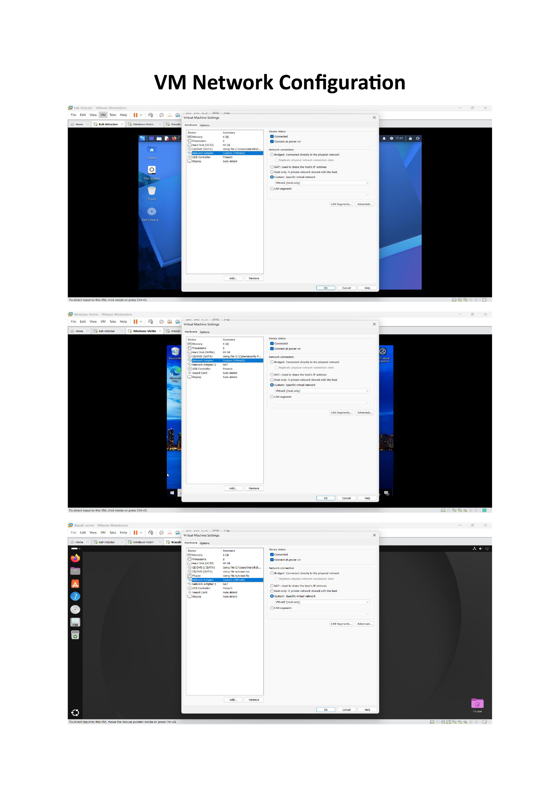
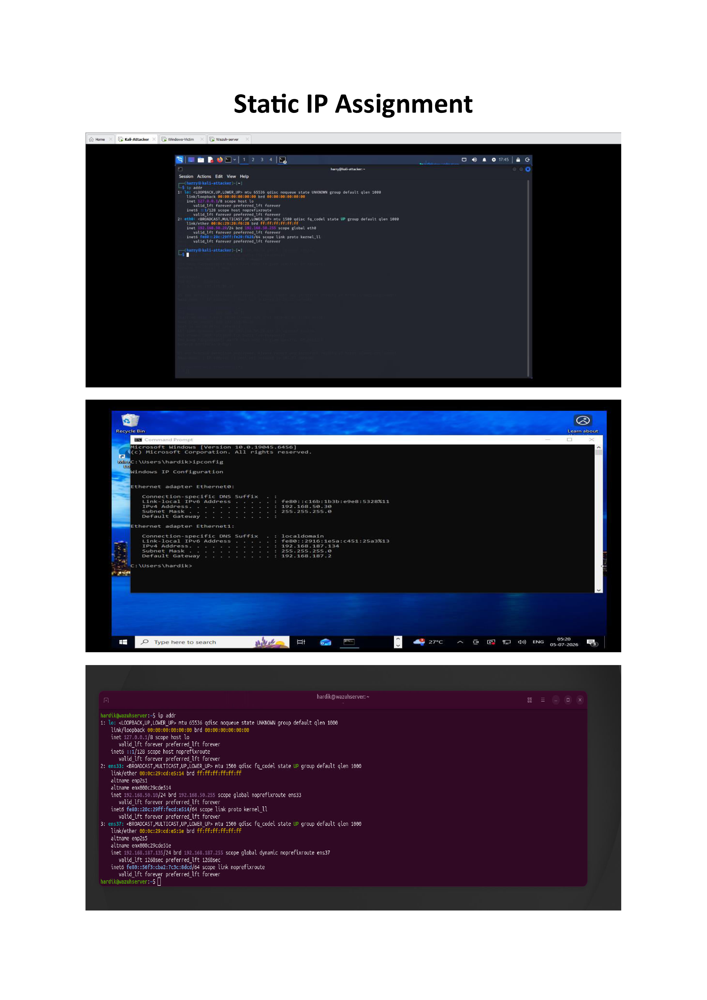
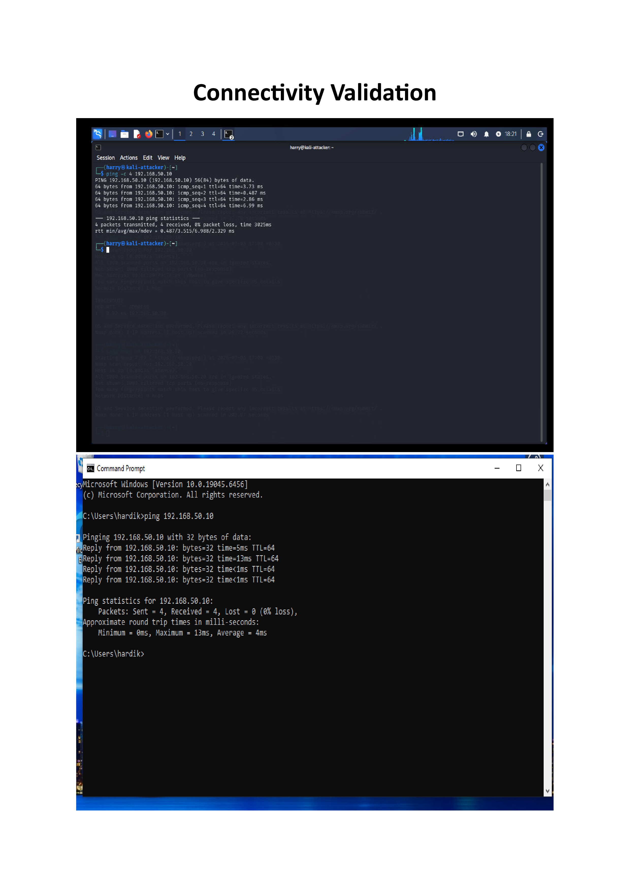

# SOC Lab Setup

## Overview

The first phase of the BlueSentinel SOC Lab focused on designing and deploying a secure, isolated virtual environment capable of supporting enterprise-style Security Operations Center (SOC) operations.

The objective was to establish a stable infrastructure consisting of an attacker machine, a monitored Windows endpoint, and a centralized Wazuh SIEM server. This environment serves as the foundation for monitoring, threat detection, incident investigation, and response activities performed throughout the project.

---

# Objectives

- Build an isolated enterprise SOC laboratory.
- Deploy multiple virtual machines for attack simulation and monitoring.
- Configure an internal VMware network.
- Assign static IP addresses to every system.
- Verify connectivity between all machines.
- Prepare the infrastructure for centralized log collection and analysis.

---

# Lab Environment

| Machine | Operating System | Role | IP Address |
|----------|------------------|------|------------|
| Kali Linux | Kali Linux | Attacker | 192.168.50.20 |
| Windows 10 | Windows 10 Pro | Victim Endpoint | 192.168.50.30 |
| Wazuh Server | Ubuntu Server | SIEM & Log Management | 192.168.50.10 |

**Virtualization Platform:** VMware Workstation Pro

**Virtual Network:** VMnet2 (Internal Network)

---

# Infrastructure Deployment

Three dedicated virtual machines were deployed using VMware Workstation Pro and connected through an isolated VMnet2 internal network.

The deployed infrastructure consists of:

- Kali Linux attacker machine
- Windows 10 monitored endpoint
- Ubuntu Server running Wazuh SIEM

Each virtual machine was configured with a static IP address to provide reliable communication and simplify monitoring throughout the project.

## Infrastructure Screenshot

The following screenshot shows the deployed virtual machines used within the BlueSentinel SOC Lab.


---

# Network Configuration

The BlueSentinel SOC Lab operates inside VMware's VMnet2 isolated network.

This configuration prevents communication with external systems while allowing unrestricted communication between all virtual machines for realistic attack simulation and monitoring.

Network Details

- Virtual Network: VMnet2
- Network Type: Internal
- IP Addressing: Static IPv4

## VMware Network Configuration

The following screenshot shows the VMware virtual network configuration used throughout the lab.



---

# Static IP Configuration

Static IP addressing was assigned to all virtual machines to ensure predictable communication between systems and simplify investigation during later SOC activities.

Assigned IP Addresses

| Machine | IP Address |
|----------|------------|
| Wazuh Server | 192.168.50.10 |
| Kali Linux | 192.168.50.20 |
| Windows 10 | 192.168.50.30 |

## Static IP Assignment

The following screenshot shows the static IP configuration used within the environment.



---

# Network Architecture

The BlueSentinel SOC Lab follows a simple three-tier architecture.

```
        VMnet2 Internal Network

        +------------------------------+

        Kali Linux (Attacker)
            192.168.50.20

                  │

        Windows 10 (Victim)
            192.168.50.30

                  │

     Ubuntu Server + Wazuh SIEM
            192.168.50.10

        +------------------------------+
```

The isolated architecture enables realistic cyber attack simulations while preventing traffic from reaching external networks.

---

# Connectivity Validation

After completing the deployment, connectivity tests were performed between all systems.

Validation included:

- ICMP Ping between all virtual machines
- Static IP verification
- Internal network communication testing
- End-to-end connectivity validation

Successful testing confirmed that the environment was fully operational and ready for centralized monitoring.

## Connectivity Testing

The following screenshot demonstrates successful communication between the virtual machines.



---

# Outcome

Phase 1 successfully established a fully functional Security Operations Center laboratory.

The environment now provides a stable platform for:

- Endpoint monitoring
- Security event collection
- Attack simulation
- Threat detection
- Incident investigation
- Detection engineering

This infrastructure serves as the foundation for every remaining phase of the BlueSentinel SOC Lab.

---

# Phase Completion Status

| Task | Status |
|------|--------|
| VMware Workstation Installed | ✅ Completed |
| Kali Linux VM Created | ✅ Completed |
| Windows 10 VM Created | ✅ Completed |
| Ubuntu Server Installed | ✅ Completed |
| Wazuh Server Configured | ✅ Completed |
| VMnet2 Internal Network Configured | ✅ Completed |
| Static IP Addresses Assigned | ✅ Completed |
| Connectivity Validation Completed | ✅ Completed |

---

# Key Insights

- A well-designed lab architecture is essential before implementing security monitoring.
- Static IP addressing improves consistency during investigations.
- Network isolation enables safe attack simulation.
- Proper infrastructure planning reduces troubleshooting during later phases.
- Building the SOC lab first establishes a strong foundation for monitoring, detection, and incident response.
