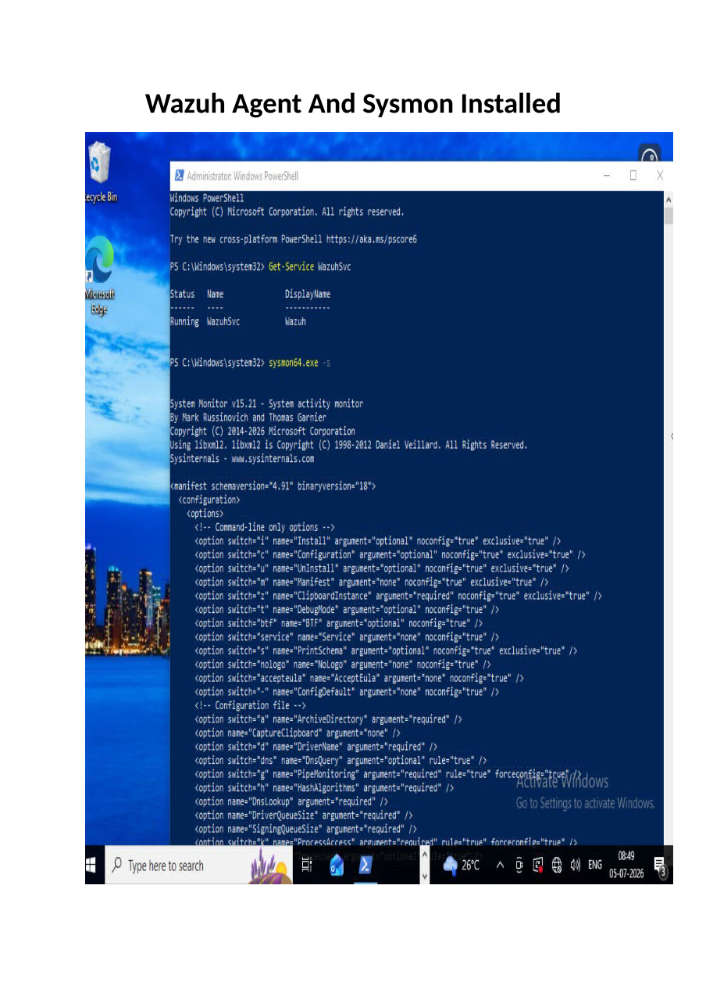
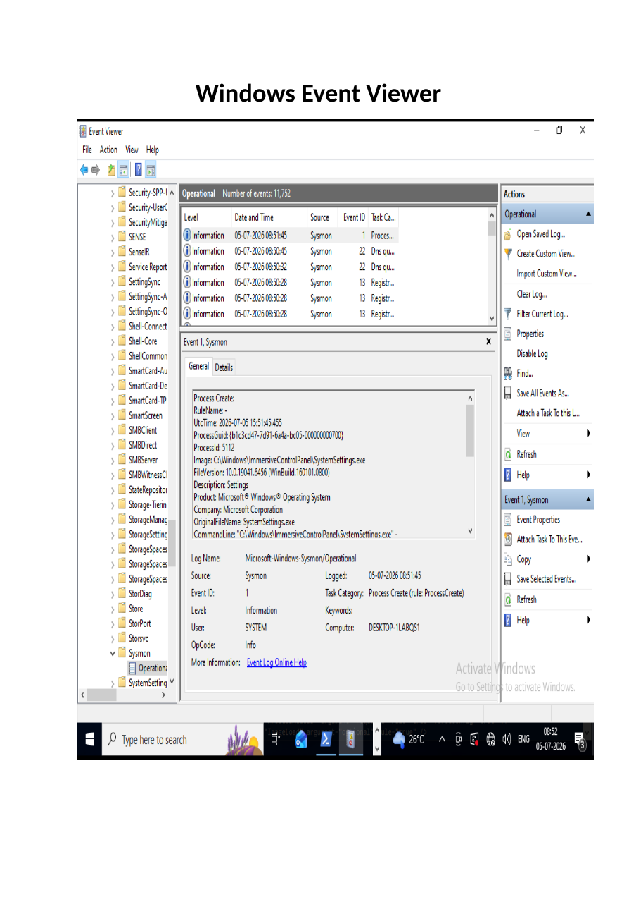
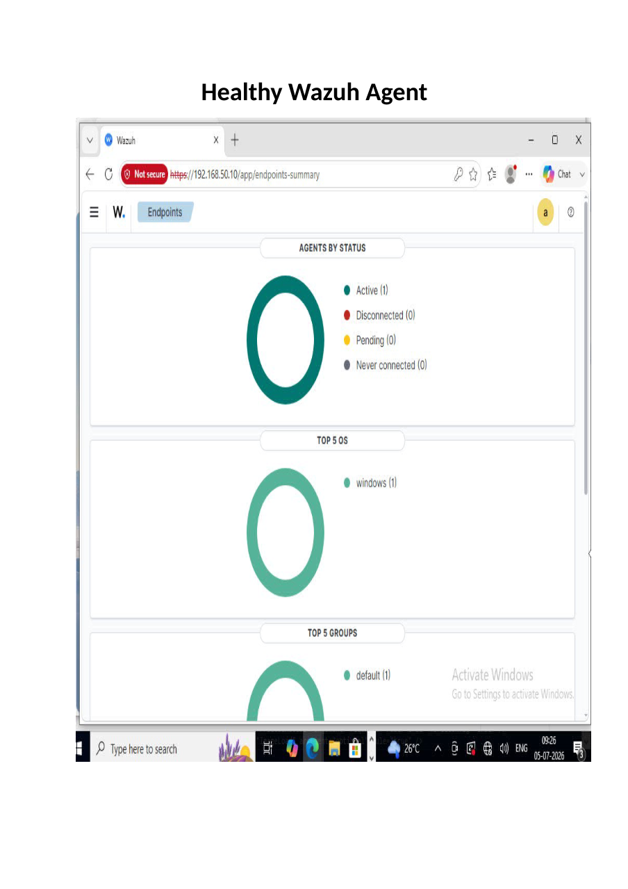
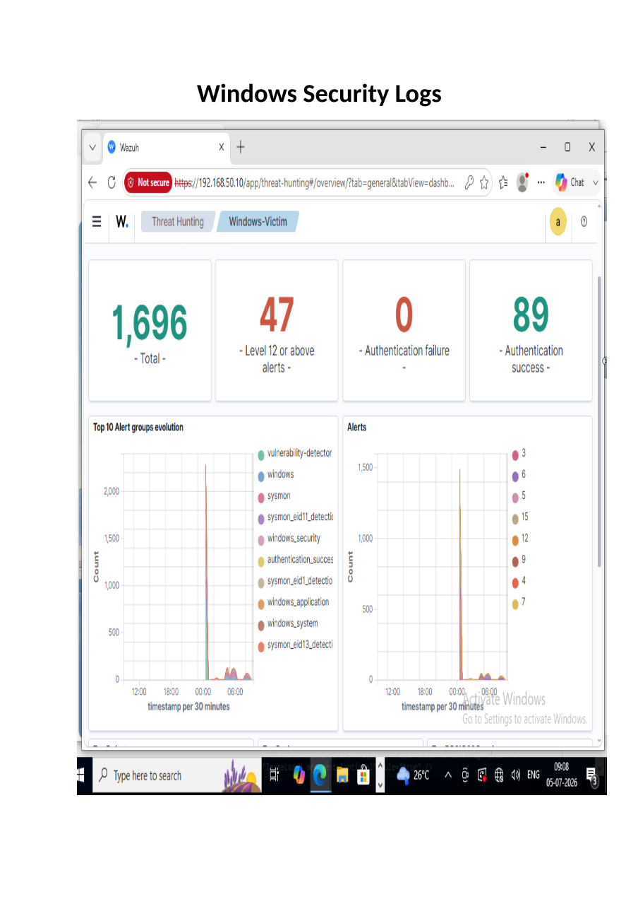
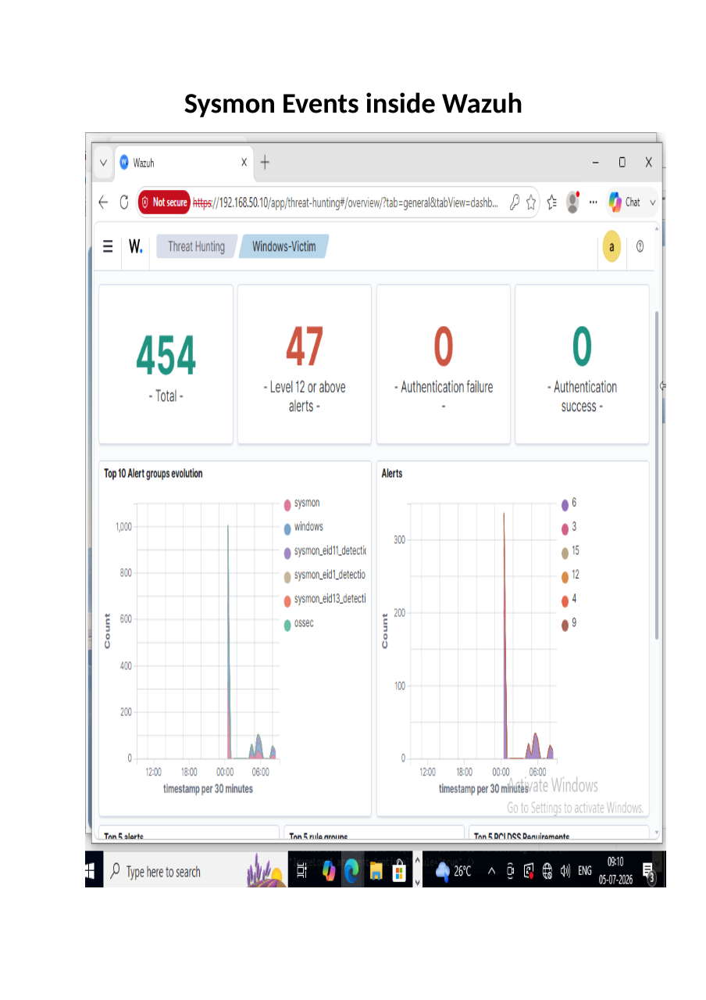
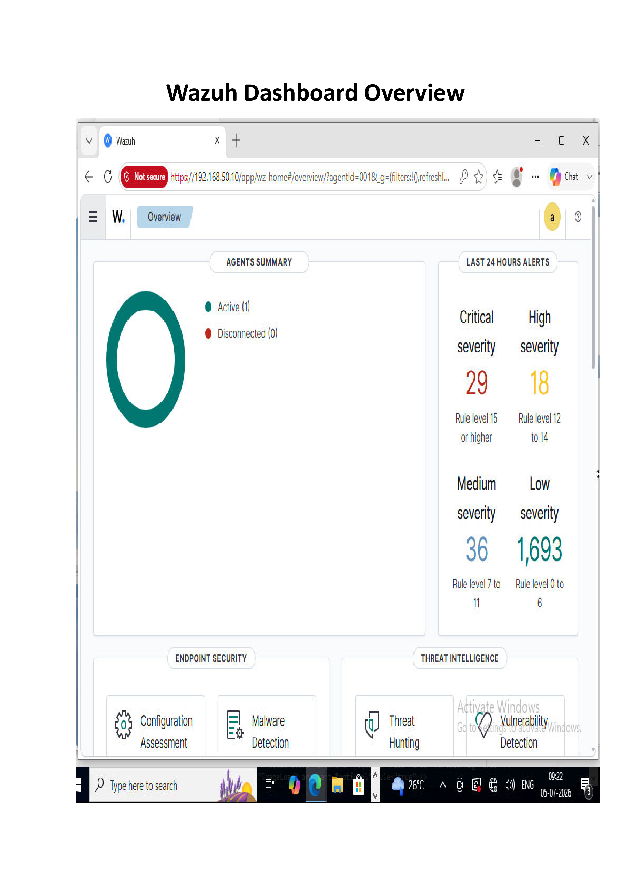

# Monitoring Configuration

## Overview

This phase focused on configuring centralized endpoint monitoring by integrating the Windows 10 endpoint with the Wazuh SIEM platform. Sysmon was deployed to enhance Windows telemetry, while the Wazuh Agent was configured to securely forward endpoint events to the Wazuh Server for analysis and visualization.

---

# Objectives

- Deploy the Wazuh Agent on the Windows endpoint.
- Install and configure Sysmon.
- Collect Windows Event Logs centrally.
- Verify successful log ingestion into Wazuh.
- Validate agent communication and monitoring.

---

# Monitoring Architecture

| Component | Purpose |
|------------|---------|
| Windows 10 | Generates security events |
| Sysmon | Provides enhanced endpoint telemetry |
| Wazuh Agent | Collects and forwards logs |
| Wazuh Server | Processes and analyzes events |
| Wazuh Dashboard | Visualizes security events |

---

# Log Collection Workflow

```text
Windows Endpoint
      │
Windows Event Logs
      │
 Sysmon Events
      │
 Wazuh Agent
      │
 Wazuh Server
      │
Wazuh Dashboard
```

---

# Validation

The monitoring configuration was validated by confirming:

- Wazuh Agent registered successfully.
- Agent status reported as Healthy.
- Windows Event Logs were collected.
- Sysmon events appeared in Wazuh.
- Continuous communication between endpoint and server.

---

# Screenshots

## 1. Sysmon and Wazuh Agent Installation



---

## 2. Sysmon Events



---

## 3. Wazuh Agent Status



---

## 4. Windows Log Collection



---

## 5. Sysmon Logs in Wazuh



---

## 6. Wazuh Dashboard



---

# Deliverables

- Wazuh Agent deployed and configured.
- Sysmon integrated with Windows.
- Windows Event Logs centralized.
- Sysmon telemetry collected successfully.
- Healthy endpoint communication verified.

---

# Outcome

The Windows endpoint was successfully integrated with the Wazuh SIEM platform. Security events and Sysmon telemetry were continuously collected and analyzed, providing the monitoring capability required for attack simulation and incident investigation in the following phases.

---

# Key Takeaways

- Centralized monitoring improves visibility across endpoints.
- Sysmon provides detailed telemetry beyond default Windows logging.
- Validating log collection before attack simulation ensures reliable detection.