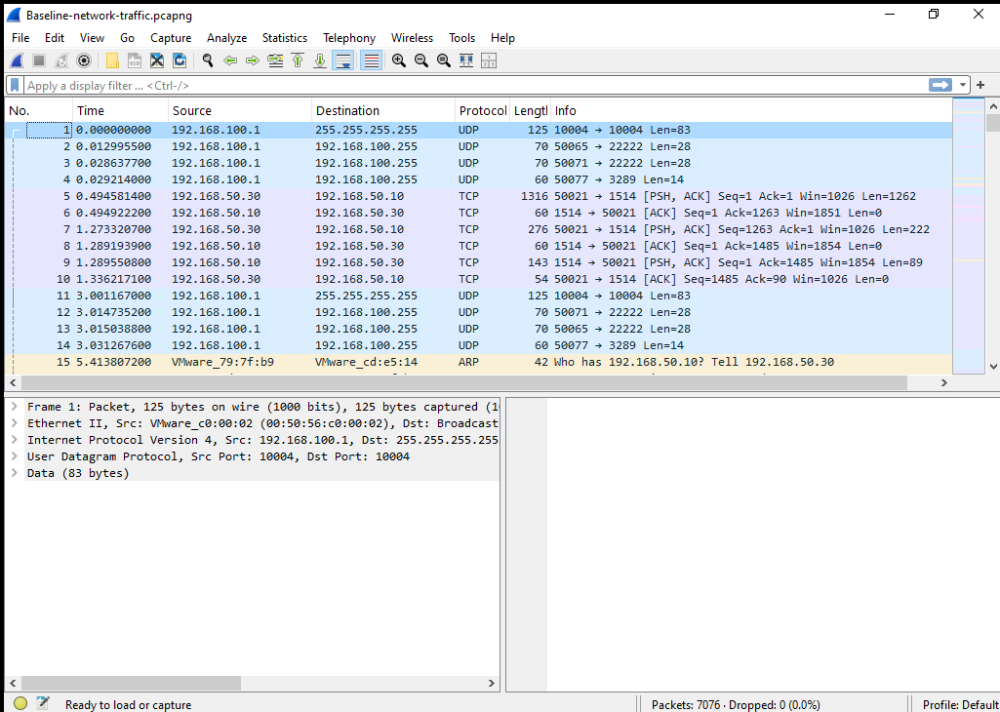
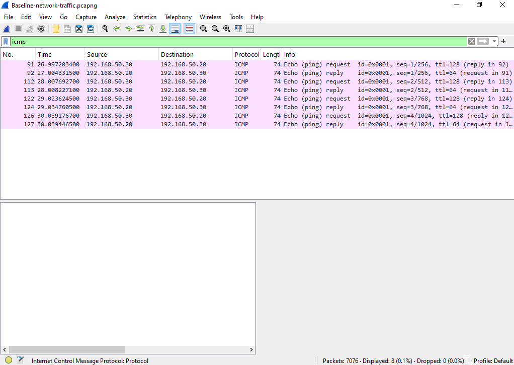
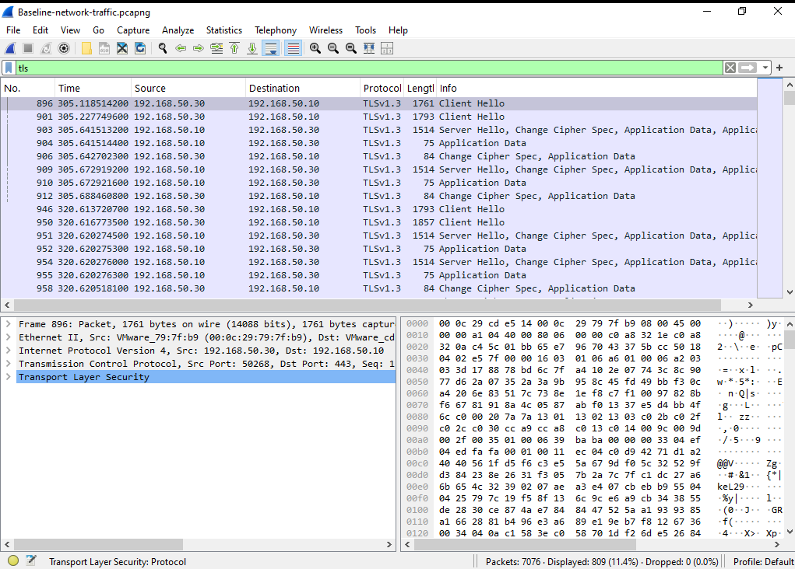
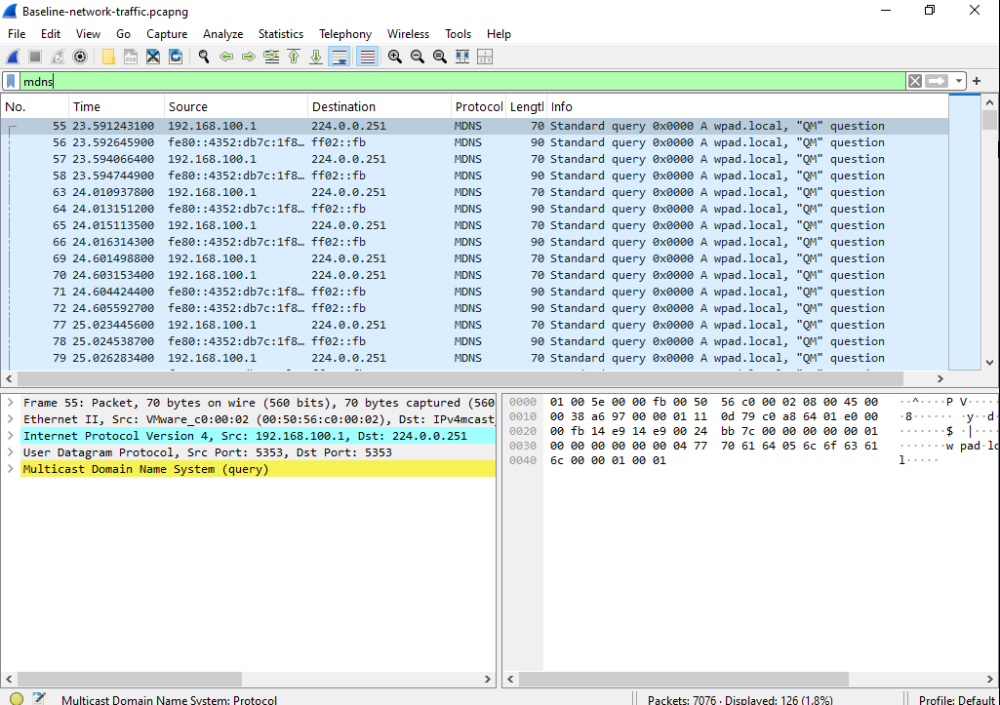
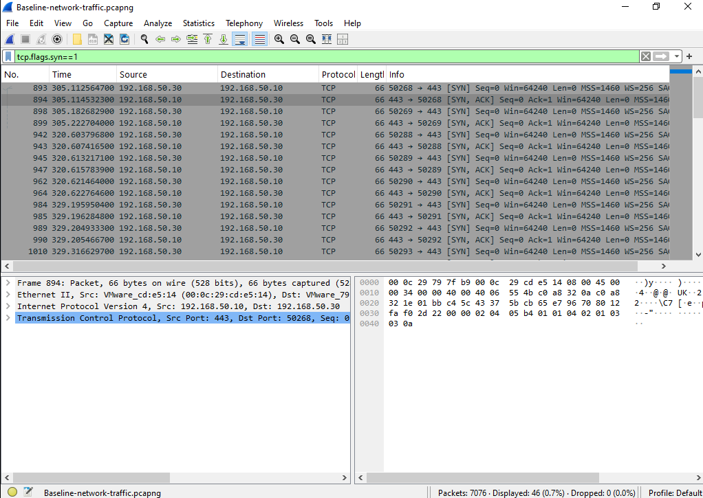
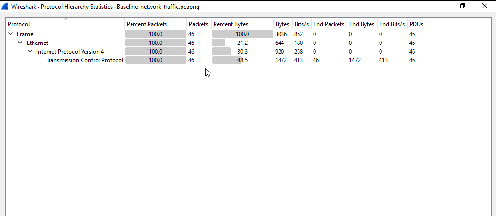
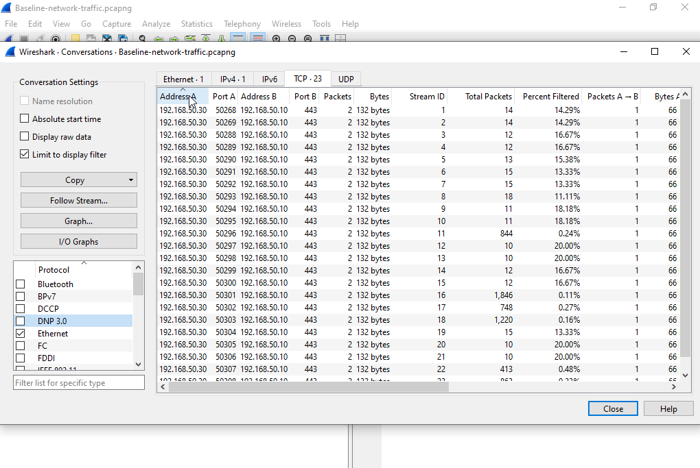

# Network Baseline

## Overview

The third phase of the BlueSentinel SOC Lab focused on establishing a network baseline by observing and analyzing normal system behavior before introducing any attack scenarios.

A network baseline represents the expected state of communications, endpoint activity, and protocol behavior under normal operating conditions. Establishing this baseline is essential for identifying anomalies, detecting malicious activity, and supporting effective incident investigations.

Network traffic was captured using **Wireshark** on the Windows endpoint while performing routine user activities such as ICMP connectivity testing, web browsing, and normal Windows background operations.

---

# Objectives

- Capture normal network traffic.
- Identify commonly used protocols.
- Observe communication patterns.
- Analyze endpoint interactions.
- Establish a trusted baseline for future attack comparison.

---

# Normal Activities Performed

The following activities were performed to generate baseline traffic:

- User logon
- ICMP ping
- Web browsing (HTTPS)
- Windows background services
- Multicast DNS (mDNS)
- Wazuh Agent communication

These activities represent expected behavior within the SOC environment.

---

# Traffic Capture

Traffic was captured using **Wireshark** from the Windows endpoint connected to the isolated VMware internal network.

The resulting packet capture serves as the reference baseline for identifying abnormal behavior during future reconnaissance and attack simulations.

---

# Protocol Analysis

| Protocol | Purpose | Observation |
|----------|----------|-------------|
| TCP | Reliable communication | Primary transport protocol |
| TLS | Secure web communication | HTTPS traffic during browsing |
| ICMP | Connectivity testing | Successful communication between lab systems |
| ARP | Address Resolution | Normal local network communication |
| mDNS | Multicast Name Resolution | Windows background service discovery |
| IPv4 | Network communication | Primary network protocol |

No abnormal protocols or unexpected traffic patterns were identified during the baseline capture.

---

# Port Analysis

| Port | Service | Purpose |
|------|----------|----------|
| 443 | HTTPS | Secure web communication |
| 1514 | Wazuh Agent | Log forwarding |
| 5353 | mDNS | Multicast service discovery |
| Dynamic Ports | Windows Client | Temporary outbound communication |

Observed ports matched expected Windows and Wazuh communication.

---

# Endpoint Analysis

The following systems participated in normal network communication:

| Endpoint | Role |
|----------|------|
| Wazuh Server | Centralized monitoring platform |
| Windows Endpoint | Monitored host |
| Kali Linux | Security testing workstation |
| VMware VMnet2 | Internal isolated network |

The observed endpoints matched the planned SOC lab architecture.

---

# Conversation Analysis

Wireshark conversation statistics confirmed continuous communication between the monitored endpoint and the Wazuh Server.

Observed communication included:

- Windows Endpoint ↔ Wazuh Server
- HTTPS web traffic
- Windows background services
- mDNS service discovery
- Wazuh Agent log forwarding

These conversations established the expected communication profile of the environment.

---

# Baseline Summary

The baseline analysis identified the following characteristics:

- Stable communication between virtual machines.
- Continuous Wazuh Agent connectivity.
- Normal HTTPS browsing activity.
- Expected Windows background traffic.
- No suspicious communication patterns.
- No unexpected endpoints.
- No abnormal protocol usage.

This baseline serves as the reference point for all future attack simulations within the SOC lab.

---

# Validation

Baseline validation included:

- Successful packet capture.
- Protocol Hierarchy analysis.
- TCP conversation analysis.
- Endpoint verification.
- Continuous Wazuh monitoring.

These validation steps confirmed that the captured traffic accurately represents normal operating conditions.

---

# Screenshots

## 1. Wireshark Packet Capture

---

## 2. ICMP Baseline Traffic

---

## 3. HTTPS / TLS Traffic

---

## 4. Multicast DNS (mDNS)

---

## 5. TCP Three-Way Handshake

---

## 6. Protocol Hierarchy

---

## 7. Network Conversations

---

# Deliverables

The following deliverables were successfully completed:

- Baseline packet capture (.pcapng)
- Protocol analysis
- Endpoint analysis
- TCP conversation analysis
- Network baseline documentation
- Supporting screenshots

---

# Outcome

At the conclusion of Phase 3, a comprehensive network baseline was successfully established for the BlueSentinel SOC Lab.

The collected packet capture accurately represents normal operating conditions and provides a trusted reference for detecting anomalous activity during future reconnaissance, attack simulations, threat hunting, and incident investigations.

---

# Key Insights

- Understanding normal network behavior is essential before introducing attack scenarios.
- Network baselines significantly reduce false positives during security monitoring.
- Packet analysis provides valuable context during incident investigations.
- Combining endpoint telemetry with network traffic improves overall detection capability.
- A well-documented baseline strengthens future detection engineering and threat hunting activities.