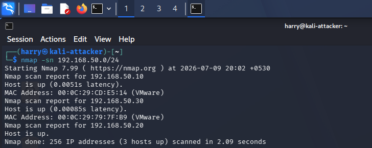
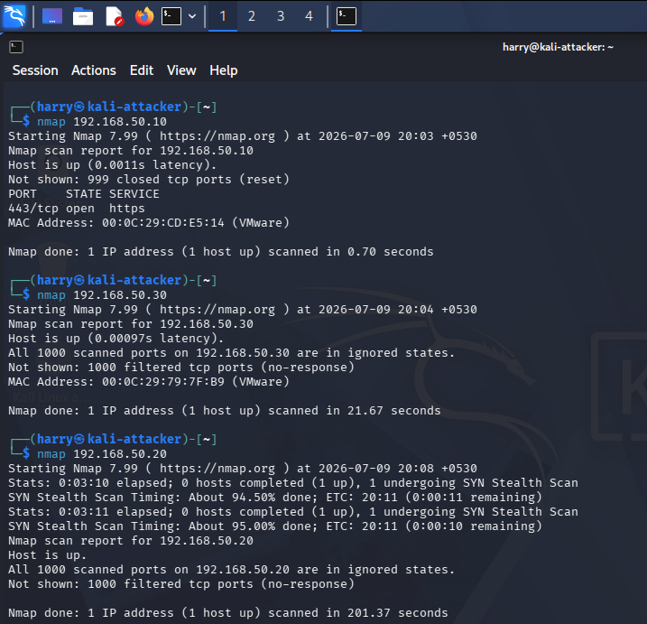
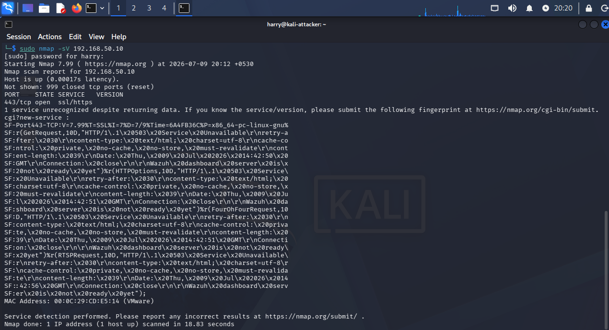
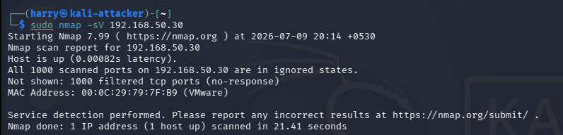
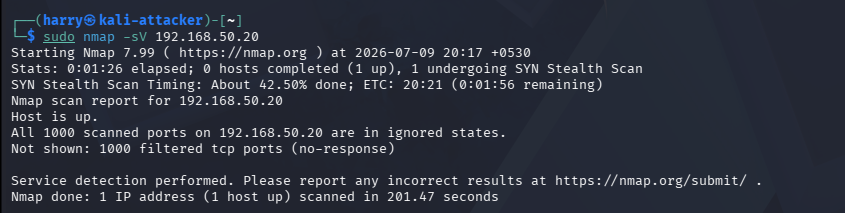
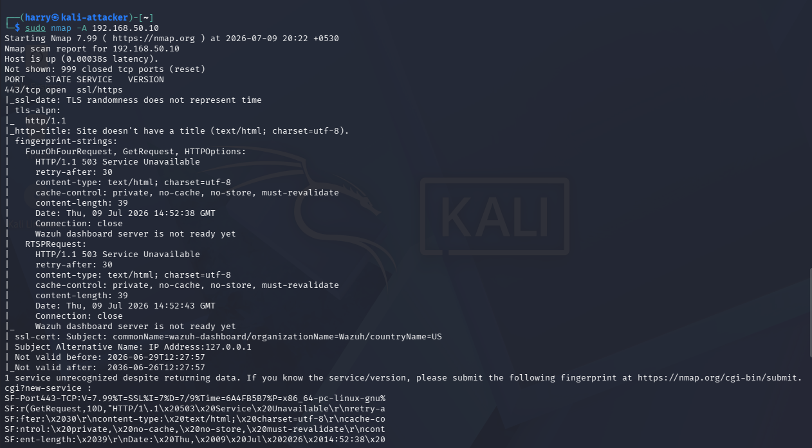
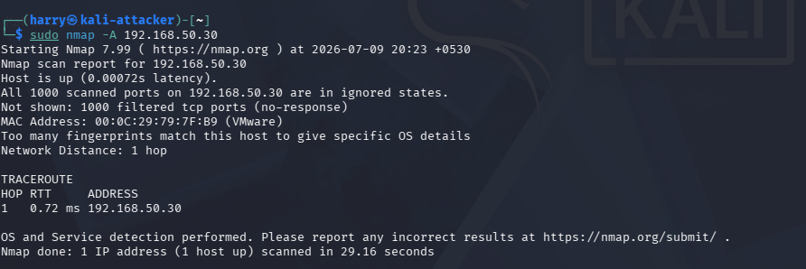
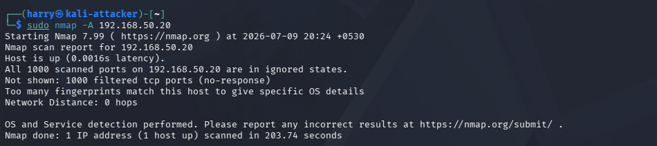

# Asset Inventory

## Overview

The fourth phase of the BlueSentinel SOC Lab focused on identifying and documenting all systems and network services within the isolated SOC environment. Asset discovery was performed using Nmap to identify live hosts, enumerate open ports, detect running services, and gather operating system information.

Maintaining an accurate asset inventory is a fundamental Security Operations Center (SOC) activity. Understanding what systems exist and which services they expose enables effective monitoring, vulnerability assessment, threat detection, and incident response.

---

# Objectives

- Identify all active hosts on the internal network.
- Discover exposed network ports.
- Detect running services and applications.
- Identify operating systems where possible.
- Create a complete asset inventory.
- Document network services for future monitoring.

---

# Host Discovery

Initial reconnaissance was performed using an ICMP host discovery scan to identify all active devices within the VMware internal network.

Command used:

```bash
nmap -sn 192.168.50.0/24
```

The scan identified three active systems:

- Wazuh Server
- Kali Linux
- Windows 10 Endpoint

---

## Host Discovery



---

# Basic Port Discovery

A basic Nmap scan was performed against each discovered host to identify commonly exposed TCP ports.

Command used:

```bash
nmap <target-ip>
```

This scan revealed the Wazuh Dashboard running over HTTPS while confirming that the Windows and Kali systems had minimal exposed services due to firewall configurations.

---

## Basic Port Scan



---

# Service Detection

Service version detection was performed to identify applications listening on discovered ports.

Command used:

```bash
nmap -sV <target-ip>
```

This scan identified service banners and application information required for asset documentation.

---

## Wazuh Service Detection



---

## Windows Service Detection



---

## Kali Service Detection



---

# Aggressive Enumeration

An aggressive Nmap scan was executed to gather additional information including:

- Operating system fingerprinting
- Service versions
- Default NSE script results
- SSL certificate information
- HTTP title detection
- Traceroute information

Command used:

```bash
sudo nmap -A <target-ip>
```

---

## Wazuh Aggressive Scan



---

## Windows Aggressive Scan



---

## Kali Aggressive Scan



---

# Asset Inventory

| Host | IP Address | Operating System | Role |
|------|------------|------------------|------|
| Wazuh Server | 192.168.50.10 | Ubuntu Server | SIEM Platform |
| Kali Linux | 192.168.50.20 | Kali Linux | Attacker Machine |
| Windows 10 | 192.168.50.30 | Windows 10 | Monitored Endpoint |

---

# Network Service Inventory

| Host | Port | Service | Status |
|------|------|---------|--------|
| Wazuh Server | 443 | HTTPS / Wazuh Dashboard | Open |
| Windows Endpoint | Filtered | Windows Services | Running |
| Kali Linux | Filtered | Testing Environment | Running |

---

# Findings

The asset discovery process successfully identified every system deployed within the BlueSentinel SOC Lab. The Wazuh Server exposed the HTTPS management interface, while the Windows and Kali systems remained protected through host-based firewall configurations.

No unauthorized hosts or unexpected network services were detected during the enumeration process.

---

# Deliverables

The following deliverables were completed during this phase:

- Complete host inventory
- Network service inventory
- Open port identification
- Service detection
- Operating system fingerprinting
- Asset documentation
- Supporting screenshots

---

# Outcome

At the conclusion of Phase 4, a complete inventory of the SOC lab environment was established. Each virtual machine was successfully identified, documented, and associated with its network services and operational role.

This inventory provides the foundation for the upcoming reconnaissance, packet analysis, alert investigation, and detection engineering phases.

---

# Key Insights

- Asset visibility is the foundation of effective security monitoring.
- Nmap provides rapid identification of hosts, ports, and running services.
- Accurate asset inventories improve vulnerability management and incident response.
- Service enumeration enables analysts to understand the attack surface before performing security assessments.
- Maintaining an up-to-date inventory simplifies future threat hunting and detection engineering activities.