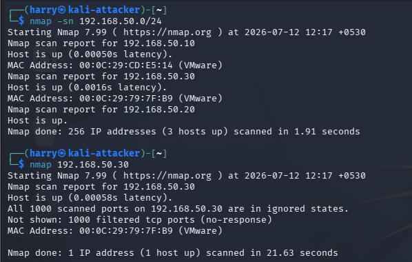
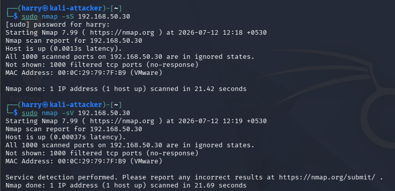
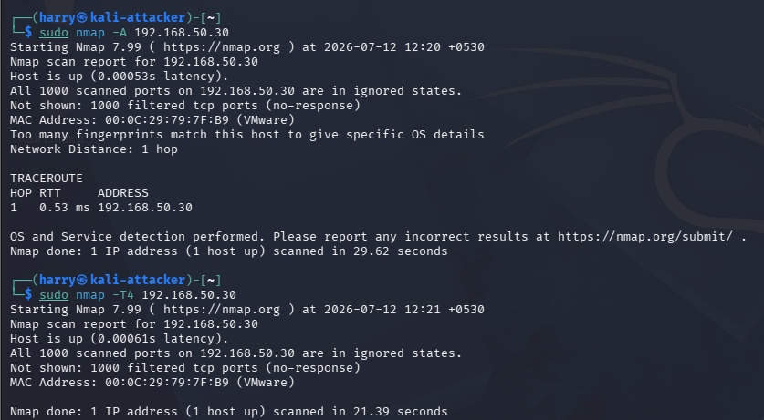

# Simulate Reconnaissance

## Overview

The fifth phase of the BlueSentinel SOC Lab focused on simulating reconnaissance activities against the Windows endpoint using Nmap. Reconnaissance is the first stage of many cyber attacks, where an attacker gathers information about target systems before attempting exploitation.

During this phase, multiple Nmap scanning techniques were executed from the Kali Linux attacker machine while Wireshark captured the generated network traffic. The collected traffic will be analyzed in the next phase to investigate attacker behavior and identify reconnaissance patterns.

---

# Objectives

- Simulate attacker reconnaissance.
- Discover active hosts on the network.
- Identify open ports.
- Enumerate running services.
- Generate realistic network traffic for packet analysis.
- Prepare evidence for Wireshark and Wazuh investigation.

---

# Attack Environment

| Role | Machine | IP Address |
|------|---------|------------|
| Attacker | Kali Linux | 192.168.50.20 |
| Target | Windows 10 | 192.168.50.30 |
| SIEM | Wazuh Server | 192.168.50.10 |

---

# Reconnaissance Techniques

The following Nmap scans were performed during the attack simulation.

| Scan | Purpose |
|------|---------|
| Host Discovery (`-sn`) | Identify active hosts |
| Basic Port Scan | Discover open TCP ports |
| SYN Scan (`-sS`) | Perform stealth port scanning |
| Service Detection (`-sV`) | Identify running services |
| Aggressive Scan (`-A`) | Perform OS detection, version detection, NSE scripts and traceroute |
| Fast Timing Scan (`-T4`) | Increase scanning speed to generate higher traffic volume |

---

# Attack Timeline

| Step | Activity |
|------|----------|
| 1 | Host Discovery |
| 2 | Basic Port Scan |
| 3 | SYN Scan |
| 4 | Service Detection |
| 5 | Aggressive Scan |
| 6 | Fast Timing Scan |

---

# Reconnaissance Results

The reconnaissance identified active systems within the isolated SOC lab and collected information about exposed services on the Windows endpoint. The aggressive and fast timing scans generated sufficient network traffic to support detailed packet investigation during the next phase.

No exploitation was performed during this phase. The objective was limited to information gathering and enumeration.

---

# Evidence

## Host Discovery and Basic Port Scan

The attacker successfully identified active hosts and performed an initial scan to discover accessible TCP ports on the Windows endpoint.

---

## SYN Scan and Service Detection

A TCP SYN scan was executed to identify open ports using a stealth scanning technique. Service detection was then performed to enumerate the applications running on the discovered ports.

---

## Aggressive Scan and Fast Timing Scan

An aggressive scan collected additional information including operating system fingerprints, service versions, traceroute data, and NSE script results. A fast timing scan generated higher volumes of reconnaissance traffic for later packet analysis.

---

# Deliverables

- Reconnaissance scan results
- Network traffic capture (.pcapng)
- Attack timeline
- Supporting screenshots

---

# Outcome

The reconnaissance phase successfully simulated the initial actions of an attacker within the BlueSentinel SOC Lab. Multiple Nmap scanning techniques generated realistic network traffic that will be examined during the packet investigation phase. This captured traffic serves as the primary evidence for identifying reconnaissance behavior and validating detection capabilities.

---

# Key Insights

- Reconnaissance is the first stage of many cyber attacks.
- Different Nmap scan types generate different network traffic patterns.
- SYN scans produce identifiable packet sequences that can be detected in packet captures.
- Information gathered during reconnaissance is commonly used to plan later attack stages.
- Capturing reconnaissance traffic enables effective detection engineering and incident investigation.