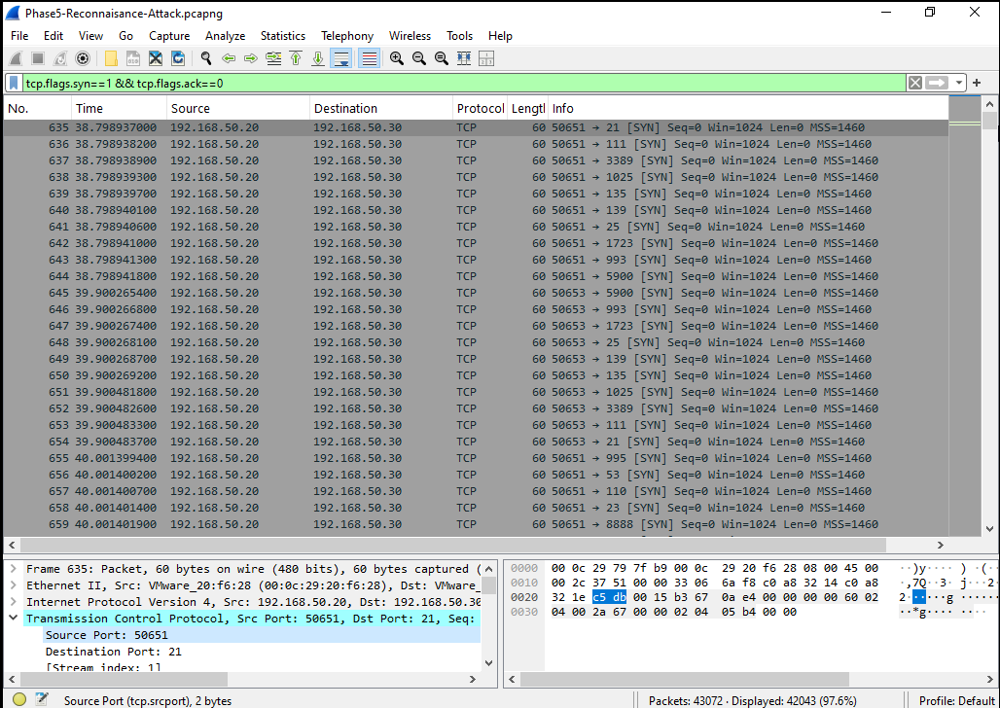
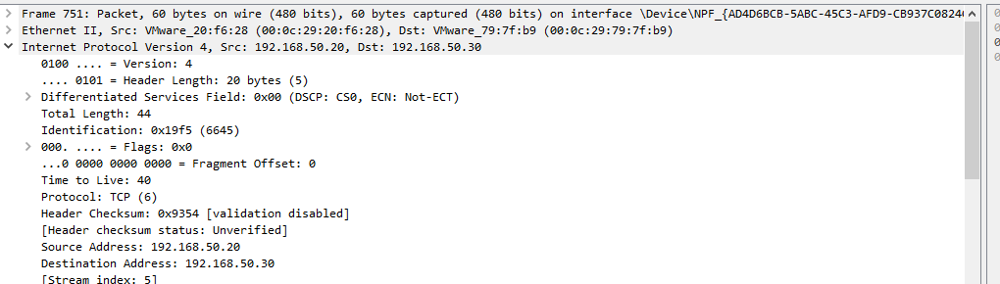
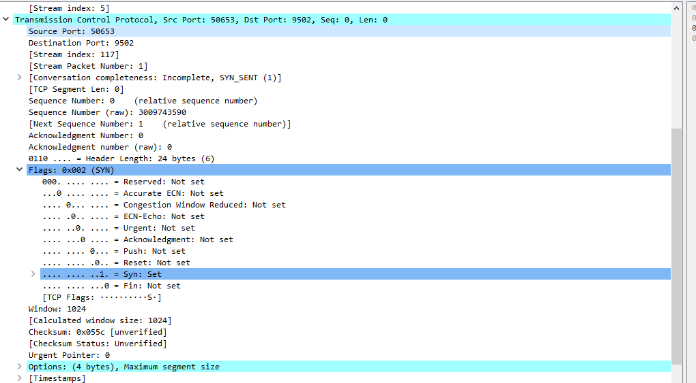
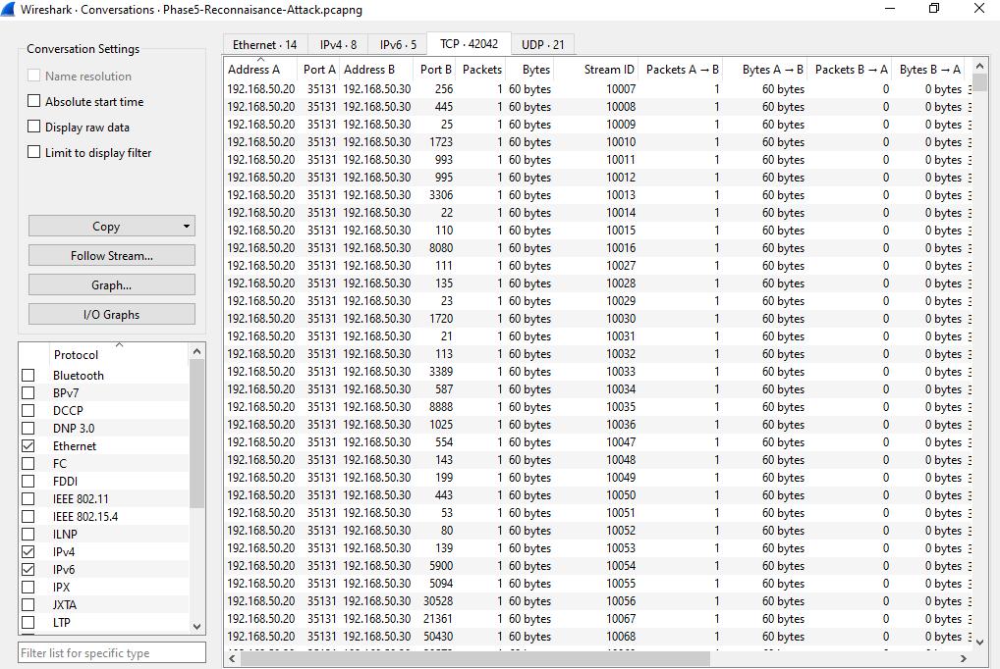
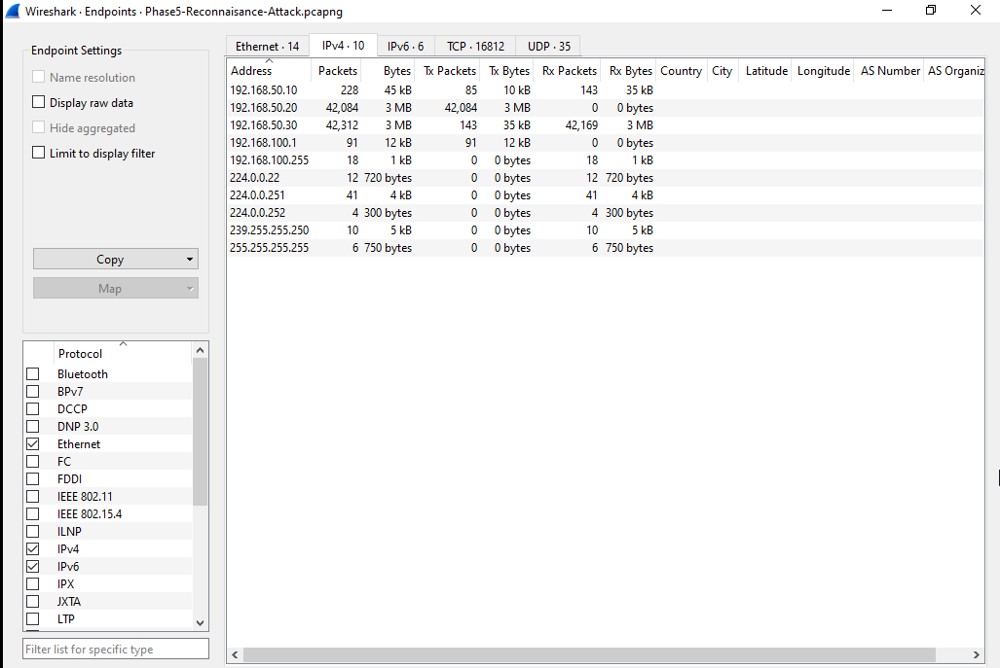
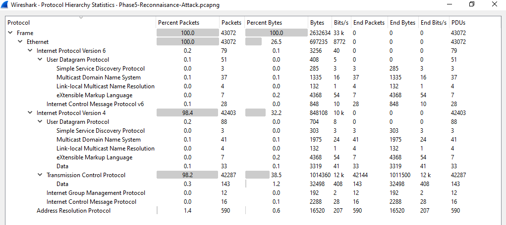
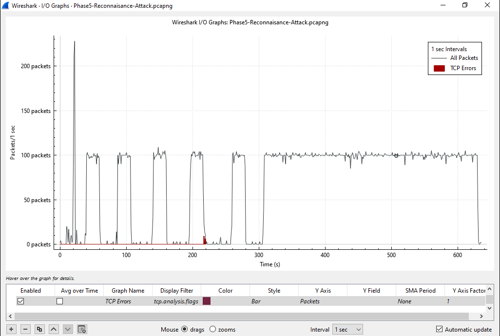

# Packet Investigation

## Overview

The sixth phase of the BlueSentinel SOC Lab focused on analyzing reconnaissance traffic at the packet level using Wireshark.

The packet capture generated during the reconnaissance phase was examined to identify the attacker, target system, scanned ports, communication patterns, and network behavior. This analysis demonstrates how a SOC analyst investigates suspicious network activity using packet-level evidence.

---

# Objectives

- Analyze reconnaissance traffic captured in Wireshark.
- Identify the source and destination systems.
- Examine TCP SYN packets.
- Investigate connection attempts and port scanning behavior.
- Analyze communication patterns.
- Document network evidence for incident investigation.

---

# Investigation Workflow

The captured attack traffic was analyzed using multiple Wireshark features to reconstruct the reconnaissance activity.

The investigation included:

- SYN packet analysis
- Source and destination IP identification
- Port scanning analysis
- Conversation analysis
- Endpoint analysis
- Protocol hierarchy analysis
- Traffic timing analysis

---

# Packet Analysis

The investigation confirmed that the attacker initiated a TCP SYN scan against the Windows endpoint.

Key observations:

- Source IP: **192.168.50.20 (Kali Linux)**
- Destination IP: **192.168.50.30 (Windows 10)**
- Scan Type: TCP SYN Scan
- Multiple destination ports were probed within a short period.
- Network activity matched reconnaissance behavior.

---

# Investigation Findings

| Finding | Observation |
|---------|-------------|
| Attacker | Kali Linux (192.168.50.20) |
| Target | Windows Endpoint (192.168.50.30) |
| Technique | TCP SYN Port Scan |
| Evidence | Multiple SYN packets sent to sequential ports |
| Communication | Multiple TCP conversations between attacker and victim |
| Result | Successful reconnaissance activity detected |

---

# Evidence

## 1. SYN Packet Analysis

Captured TCP SYN packets generated during the reconnaissance scan.

---

## 2. Source and Destination Identification

Inspection of the IP header confirmed the attacking host and the target endpoint.

---

## 3. Port Scanning Analysis

Analysis of the TCP header verified SYN flags and multiple connection attempts to different destination ports.

---

## 4. Conversation Analysis

Wireshark Conversations view showed repeated TCP sessions between the attacker and the target system.

---

## 5. Endpoint Analysis

Endpoint statistics identified all participating hosts and their communication volumes.

---

## 6. Protocol Hierarchy

Protocol Hierarchy statistics showed that the majority of captured traffic consisted of IPv4 and TCP packets generated during reconnaissance.

---

## 7. Traffic Timing Analysis

The I/O Graph highlighted traffic spikes corresponding to the execution of Nmap scans.

---

# Validation

The investigation successfully confirmed:

- Reconnaissance traffic was captured.
- The attacker was identified.
- The target system was identified.
- TCP SYN packets were verified.
- Multiple destination ports were scanned.
- Communication patterns matched Nmap reconnaissance activity.

---

# Deliverables

- Packet investigation
- Attack packet analysis
- Wireshark evidence
- Annotated investigation screenshots
- Communication analysis
- Protocol analysis
- Investigation documentation

---

# Outcome

The packet investigation successfully reconstructed the reconnaissance activity performed during Phase 5. Using Wireshark, the attacker, target, scan technique, communication flow, and timing of the attack were identified through packet-level evidence.

This investigation demonstrates how packet analysis supports threat hunting, incident response, and network forensics within a Security Operations Center (SOC).

---

# Key Insights

- Packet-level analysis provides direct evidence of attacker activity.
- TCP SYN packets are reliable indicators of reconnaissance scans.
- Conversation and Endpoint statistics simplify identifying communicating systems.
- Protocol Hierarchy helps distinguish normal and suspicious traffic.
- Timing analysis correlates network activity with attack execution.
- Wireshark is an essential tool for network forensics and SOC investigations.