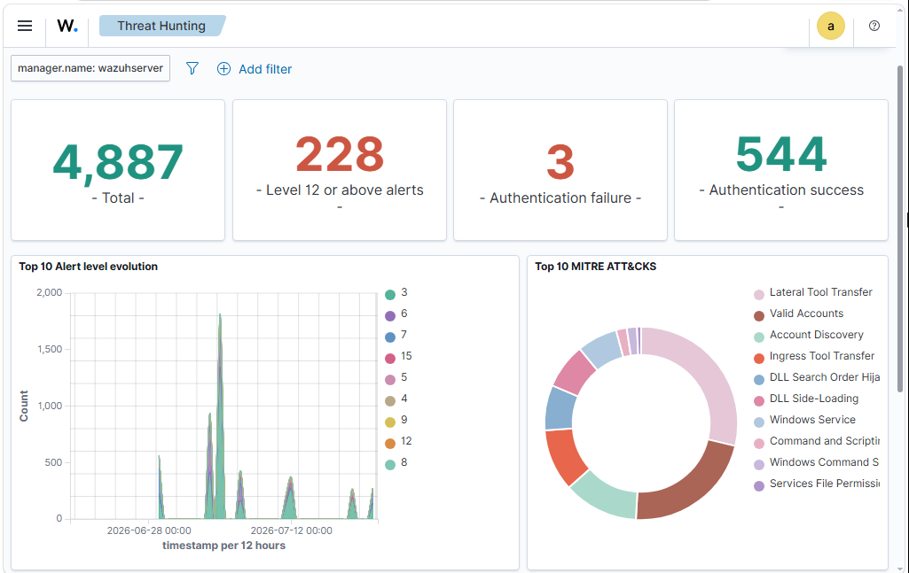
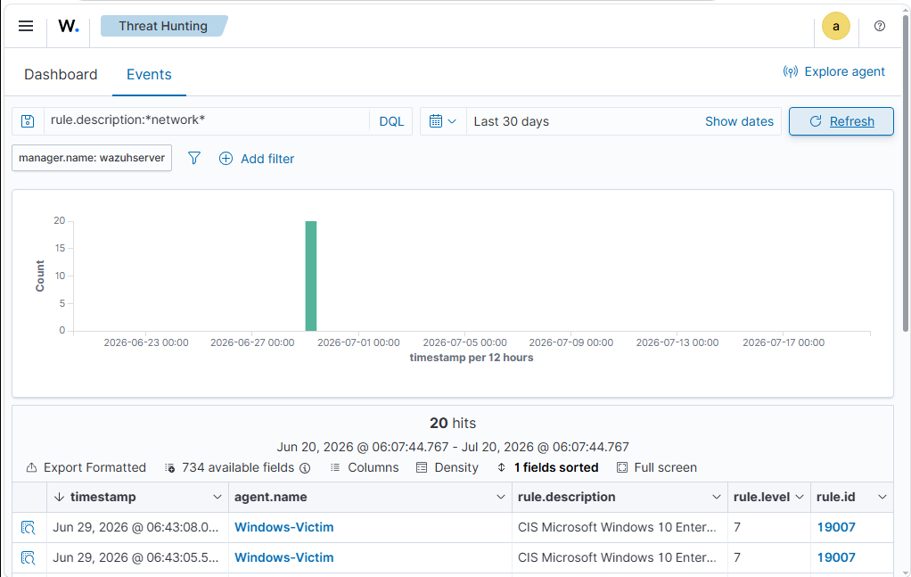
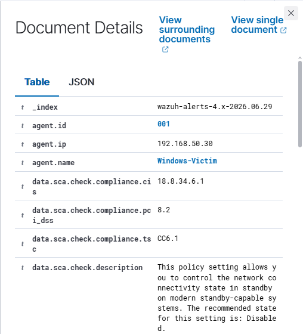
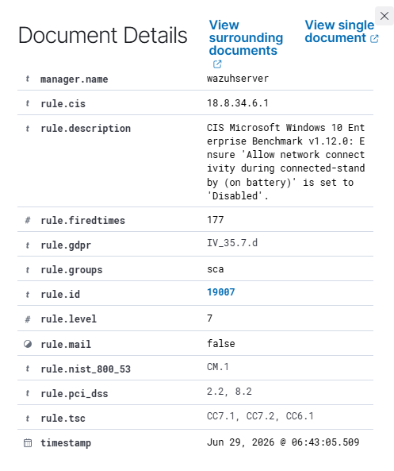
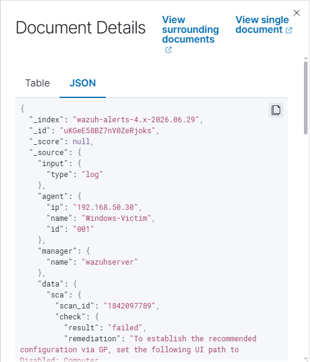
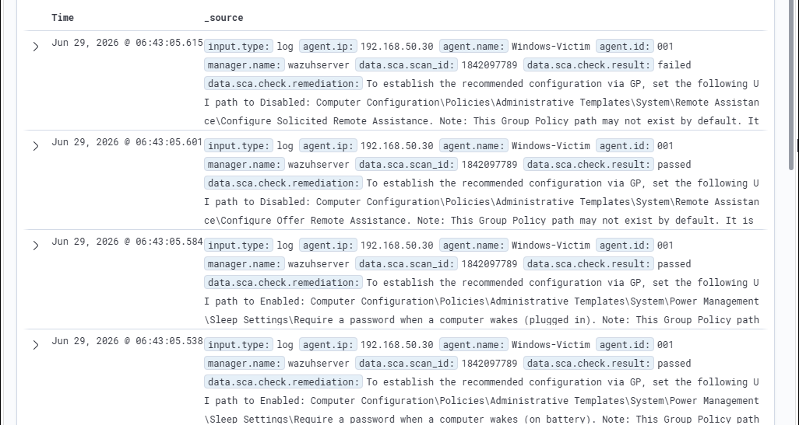

# Phase 7 — Alert Triage & Investigation

## Objective

Perform Security Operations Center (SOC) alert triage by investigating security events generated during reconnaissance activities, validating Wazuh detections, and documenting forensic evidence collected from the monitored Windows endpoint.

---

## Activities Performed

- Monitored security events using the Wazuh Threat Hunting dashboard.
- Filtered Windows endpoint events to isolate network-related alerts generated during reconnaissance.
- Investigated alert metadata, including event details, rule information, and severity levels.
- Examined raw JSON logs to validate collected telemetry and event attributes.
- Reviewed surrounding events to reconstruct the investigation timeline and correlate related security events.

---

## Tools Used

- Wazuh SIEM
- Wazuh Threat Hunting
- Sysmon
- Windows 10 Endpoint

---

# Investigation Evidence

## 1. Security Events Dashboard

The Threat Hunting dashboard provides a centralized view of security alerts, alert trends, authentication events, and overall detection statistics.

---

## 2. Filtered Alert List

Network-related security events were filtered to isolate alerts generated by the monitored Windows endpoint for focused investigation.

---

## 3. Event Overview

The selected security event provides endpoint identification, agent information, IP address, and timestamp required for the initial stage of investigation.

---

## 4. Alert & Rule Details

The alert metadata includes the triggered Wazuh rule, severity level, compliance mappings, and rule information used during the investigation.

---

## 5. Event JSON (Raw Log)

The raw JSON event was analyzed to validate endpoint telemetry, event attributes, and security log details collected by Wazuh.

---

## 6. Investigation Timeline

Surrounding events were reviewed to reconstruct the sequence of activities and establish contextual evidence during the investigation.

---

# Key Outcome

Successfully performed SOC alert triage by filtering, validating, and investigating security events within the Wazuh SIEM environment. Security alerts were correlated with endpoint telemetry, detection rules, and event timelines to demonstrate a structured Security Operations Center investigation workflow aligned with industry best practices.